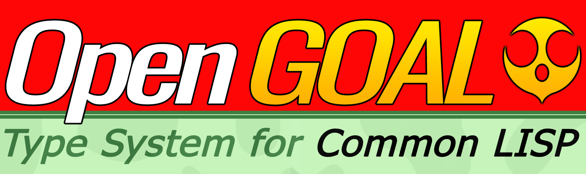

  

# The open GOAL type system for Common LISP

The implementation of the GOAL type system with Common LISP. This explanation of the GOAL type system available [here](https://open-goal.github.io/docs/reference/type_system) Or you can see the source code of whole [Jack Project](https://github.com/open-goal/jak-project)

There is the [Racket Version of this project](https://github.com/hww/open-goal-type-system-for-racket)

## This project motivations

I plan to write a GOAL compiler as an embedded solution in mobile applications or game engines. The compiler is incomplete at the moment, but the type system is ready.

## Why Common LISP

The idea to reimplement the [Racket](https://github.com/hww/open-goal-type-system-for-racket) version on Common LISP was based on the assumption that LISP would be a more suitable software development system for me. I wanted to compare Racket development and LISP development.

Differences from the Racket version:

- `type` is renamed to `gtype`
- `type-spec` is renamed to `typespec`
- Names are now strings, but in the Racket version it was symbols

## Status

It is mostly works, the test code in deftype.rkt file parsing the file all-types.gc with 34k lines of code. As result it is defining 1539 types and 89 enums. 
For a futue development reuired only a bugfixing and making better error messaging with Racket exeptions handling and Syntax locations.

## Files

- interfaces.lisp -- Interface for all types
- type.lisp -- The base type for all types
- basic-types.lisp -- All avaibale types: field, null, struct, value, bitfield, enum
- type-spec.lisp -- The universal type reference aka '(function (int int int))'
- state.lisp -- The state type functions
- type-system.lisp -- The main type system 
- builting-types.lisp -- Initializer of type system by builting types
- defenum.lisp -- The enum expression parser
- deftype.lisp -- The deftype expression parser
- rt-type.lisp -- The runtime version of basic type. Not used by type system above
- goalc-all-types.gc -- The list of typespecs of the GOAL
- goalc-type-specs.txt -- The GOAL types file used for testing
